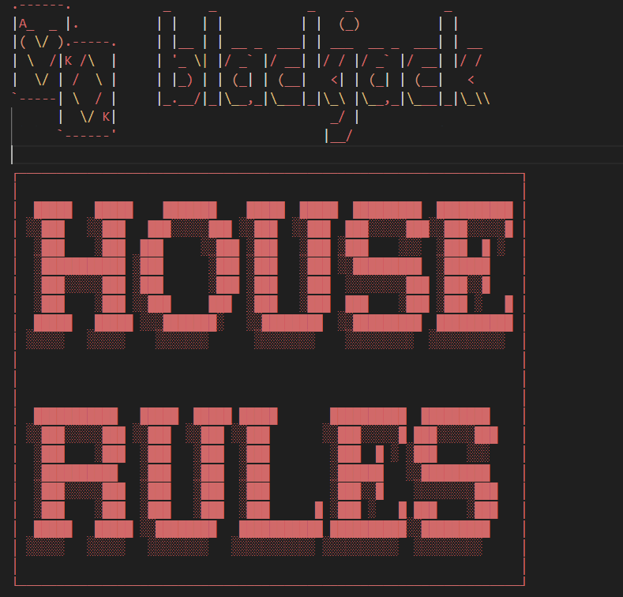
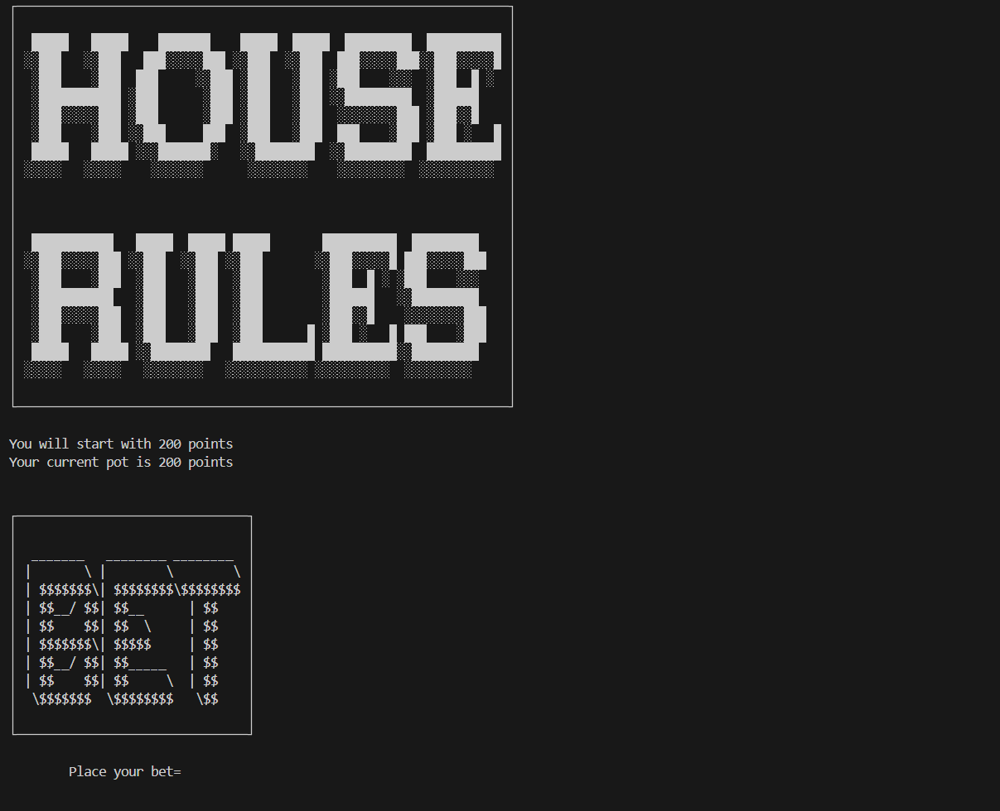
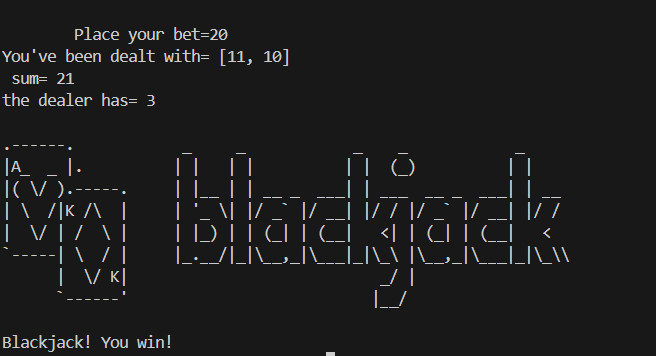
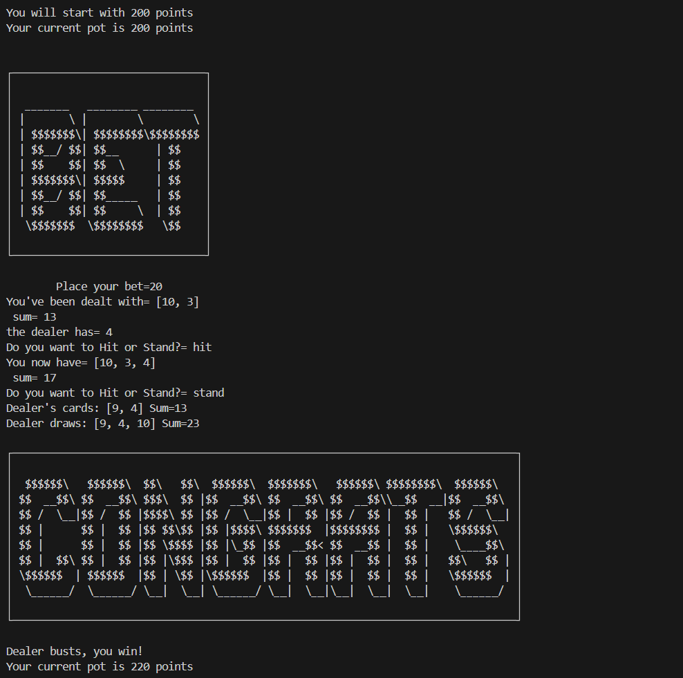

# BlackJack

## Description
A fun and interactive Blackjack (21) game built with Python. Simply download the `main.py` and `art.py` files, run the `main.py` script, and challenge the computer dealer to see if you can beat the house!

## House Rules
-The deck is unlimited in size.
-There are no jokers.
-The Jack/Queen/King all count as 10.
-The Ace can count as 11 or 1.
-Use the following list as the deck of cards:
-cards = [11, 2, 3, 4, 5, 6, 7, 8, 9, 10, 10, 10, 10]
-The cards in the list have equal probability of being drawn.
-Cards are not removed from the deck as they are drawn.
-The computer is the dealer.

## How to Play
1. Start the game and place your bet.
2. You and the dealer are each dealt two cards. One of the dealer's cards is hidden.
3. Choose to 'Hit' (draw another card) or 'Stand' (end your turn).
4. Try to get as close to 21 as possible without going over (busting).
5. The dealer reveals their hidden card and plays according to the house rules.
6. The winner is determined based on who is closer to 21 without busting.

## Screenshots

## Credits
This project was made as the first capstone project during my completion of Angela Yu's 100 Days of Code: The Complete Python Code BootCamp. However, the code logic is completely mine and I've even added a points and betting system.

Thank you :)
